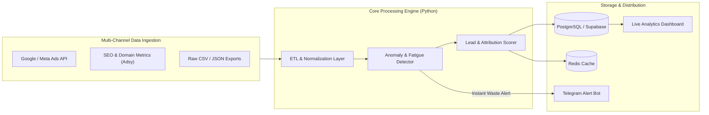

# 📊 Marketing Audit & Data Intelligence Engine

An automated high-throughput data extraction, marketing audit, and attribution pipeline designed to ingest, clean, and analyze multi-channel advertising performance (Google Ads, Meta Ads, TikTok) and SEO metrics at scale.

---

## 🏛️ Pipeline Architecture

---

## ⚡ Core Capabilities

1. **Automated Anomaly & Fatigue Detection:** Flags ROAS drop-offs, ad creative fatigue, and wasted budget segments in real time.
2. **Deterministic Attribution Modeling:** Cleanly tracks user touchpoints across multi-channel campaigns with zero data loss.
3. **High-Speed Data Ingestion:** Asynchronous batch processing handling thousands of daily data points with automated deduplication and schema validation (Pydantic V2).
4. **Instant Alerts & Reporting:** Webhook-driven dispatcher sending formatted executive summaries directly to Telegram and Slack channels.

---

## 🛠️ Tech Stack

- **Core:** Python 3.11, FastAPI, Pydantic V2, Pandas, NumPy
- **Data & Cache:** PostgreSQL, Supabase, Redis
- **Automation & Scheduling:** Celery, Redis Queues, Cron
- **Integrations:** Telegram Bot API, Google Ads API, Meta Marketing API

---

## 👨‍💻 Author & Engineering
- **Author:** [Yevhen Shaforostov](https://github.com/yevhens-hue)
- **Role:** AI Product Manager & Full-Stack AI Engineer at [Adsy.com](https://adsy.com)
